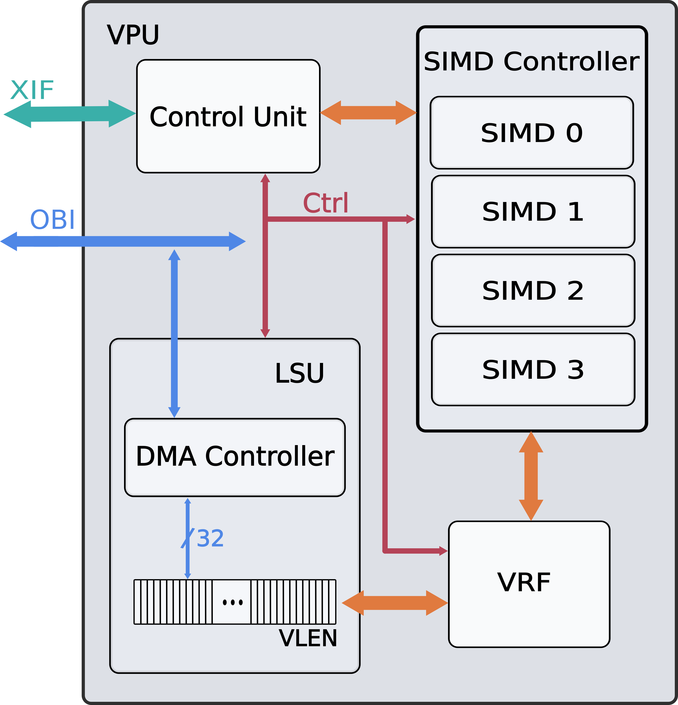

# VERMU
VERMU is a Vector Processing Unit (VPU) based on the RISC-V Zve32x vector extension, designed for embedded acceleration. It is integrated within the [X-Heep](https://github.com/x-heep/x-heep) 
 platform, its modular design allows for integration into any environment using the XIF v1.0 interface and OBI protocol.

To enable autovectorization, the RISC-V GNU Compiler Toolchain (GCC v15) is required. The following toolchain configuration is needed to target this VPU:
```
./configure \
--target=riscv32-unknown-elf \
--prefix=/tools/rv32imc_zve32x_zvl128b \
--with-arch=rv32imc_zve32x_zvl128b \
--with-abi=ilp32 \
--enable-multilib \
--with-cmodel=medlow
```

### VPU Overview


### Local environment setup
A testbench environment template is available at `tb/env.template.sh` for users who are not utilizing the X-HEEP environment.

1. Create your local machine-specific script:

```bash
cp tb/env.template.sh tb/env.sh
```

2. Edit `tb/env.sh` with your local tool and license paths.

3. Source the environment before running simulation-related Make targets:

```bash
source tb/env.sh
make build-sim
make run-vpu-unit-test
make run-questa-tb
```
